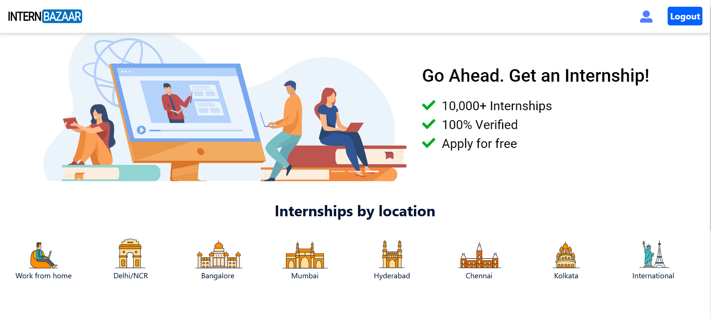
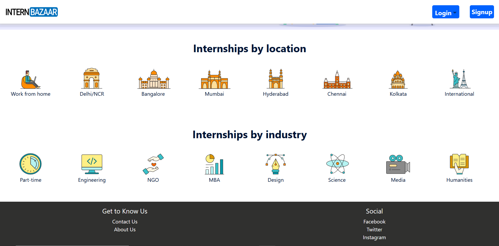
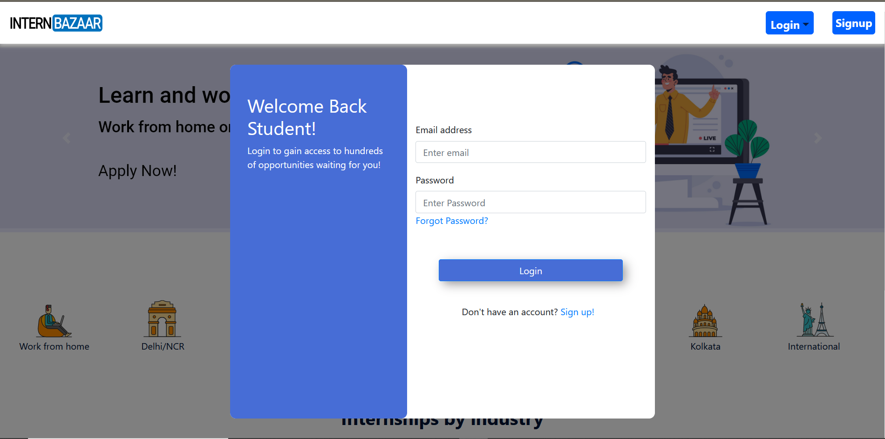
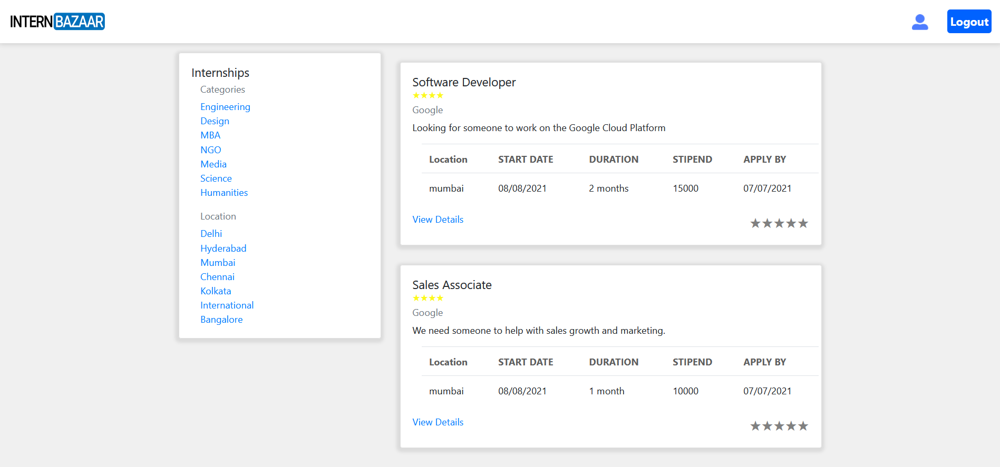
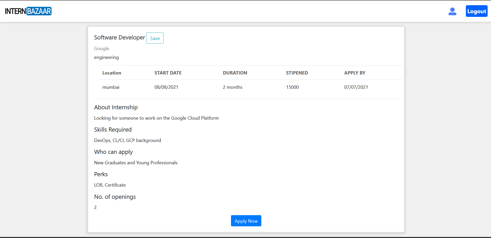
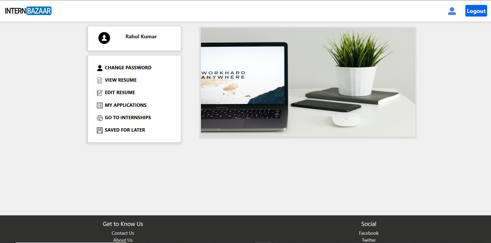
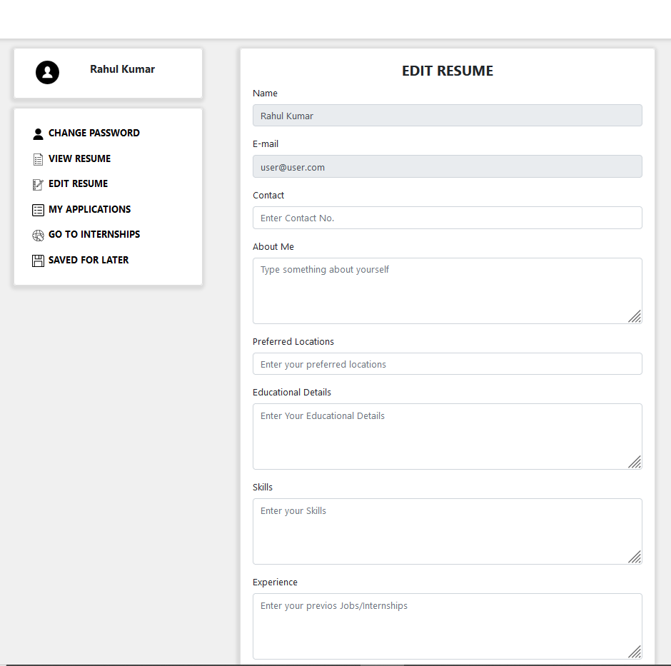
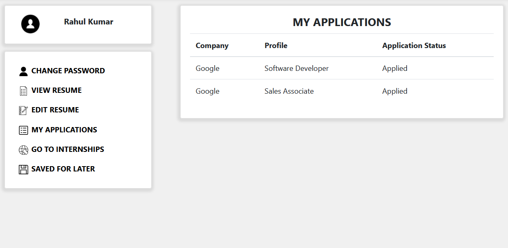
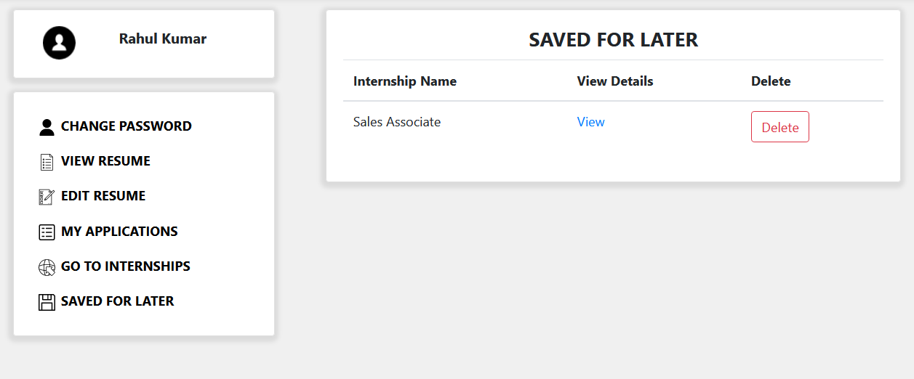
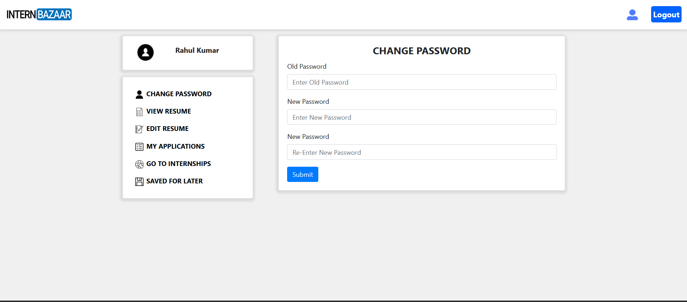

# InterBazaar project

  
  
  
  
  

 

<b>
InternBazaar helps both the employers and the internship seekers to
add and apply for various internships posted by the employers
The employer can reject or accept the user for an interview on the
basis of the resume that is created by Internbazaar
</b>

## Screens for User-role

* ### Landing Page ### 

  
  <h5>Landing Page</h5>
  

* ### Login ###

  

* ### Listed Interships ###

  

* ### Internship Detail ###

  

* ### Profile Details ###

* ### Create Resume ###

  

* ### Your Applications ###

  

* ### Saved For Later Internships ###

  

* ### Change Password ###

  

## Screens for Corporate-role

* ### List Your Event ### 

  

* ### Your Events ###

  

